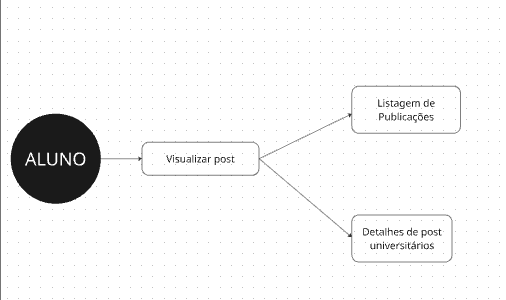
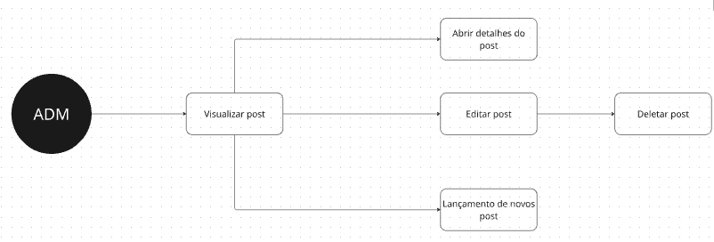

# Tech Challenge - FIAP Pós Tech - Fase 1 - Turma 8FSDT

## Descrição do Projeto
Aplicação de blogging dinâmico desenvolvida na plataforma OutSystems para auxiliar professores da rede pública a transmitirem conhecimento de forma prática e centralizada.

## O Problema
Professores da rede pública muitas vezes carecem de ferramentas para postar aulas e transmitir conhecimento de forma centralizada e tecnológica. Este projeto visa solucionar isso permitindo a criação, edição e visualização de posts educativos.

## Requisitos Funcionais
1. **Visualização de posts**: Alunos podem visualizar uma lista de posts na página principal.
2. **Leitura de posts**: Alunos podem ler posts específicos clicando no título ou conteúdo.
3. **Gerenciamento de postagens (Visão Administrativa)**:
    - Criação de postagens.
    - Edição de postagens.
    - Listagem de postagens.
    - Exclusão de postagens.

## Requisitos Técnicos
- **Plataforma**: OutSystems.
- **Layout**: Protótipo simples (sem exigência de UI/UX avançado nesta fase).
- **Autenticação**: Não necessária nesta fase.

## Documentação

### Fluxo da Aplicação
**Fluxo do Aluno:**

**Fluxo do Professor:**

### Manual de Operações Básicas
1. **Acesso à Aplicação**: Baixe o codigo fonte abra o outsystems e rode a aplicação.
2. **Perfil Aluno (Visualização)**:
   - **Listar Posts**: Utilize o menu de acesso à área do aluno.
   - **Ler Post**: Clique no título de uma postagem para visualizar o conteúdo completo.
3. **Perfil Professor (Administração)**:
   - **Acessar Área Admin**: Utilize o menu de acesso à área administrativa.
   - **Criar Post**: Clique no botão "Novo Post", preencha o Título e o Descrição, e clique em "Salvar".
   - **Editar Post**: Na lista de gerenciamento, clique no titulo do post desejado, faça as alterações e salve.
   - **Excluir Post**: Na lista de gerenciamento, clique no titulo do post e na pagina de detalhe do post na direita superior clique no botão excluir.

### Processo de Trabalho do Grupo
O desenvolvimento do projeto seguiu uma abordagem colaborativa:
- **Planejamento**: Reuniões iniciais para leitura do Tech Challenge e entendimento dos requisitos.
- **Divisão de Tarefas**: As responsabilidades foram distribuídas entre os membros, focando na modelagem de dados, criação das telas (UI) e lógica de negócios.
- **Comunicação**: Utilizamos o Discord para reuniões.
- **Desenvolvimento**: O grupo trabalhou no ambiente da OutSystems, compartilhando conhecimentos e descobertas sobre a plataforma.

### Dificuldades Encontradas
Durante o desenvolvimento, enfrentamos alguns desafios que serviram como aprendizado:
- **Curva de Aprendizado**: Adaptação inicial aos conceitos e interface do Service Studio da OutSystems.
- **Gestão de Tempo**: Conciliar as agendas de todos os integrantes para reuniões síncronas.
- **Lógica da Plataforma**: Entendimento de fluxos específicos e manipulação de dados dentro da outSystems.

## Entregáveis
- Código-Fonte (Projeto OutSystems) Anexo na atividade.
- [Apresentação gravada (Vídeo de 5 a 10 min)](https://youtu.be/pZ0JMPmS8NA).
- Documentação (este arquivo).

## Participantes

| RM | Nome | GitHub |
|----|------|--------|
| RM369454 | Antonio José Pereira Sampaio Alves | [GitHub](https://github.com/) |
| RM369372 | Fabricio Pereira Viana | [GitHub](https://github.com/fabriciopviana) |
| RM369417 | Felipe Bresolim Znidarsis | [GitHub](https://github.com/) |
| RM369227 | Jorge Davi Brandão da Silva Filho | [GitHub](https://github.com/) |
| RM369982 | Washington Barsotti | [GitHub](https://github.com/BarsottiX) |